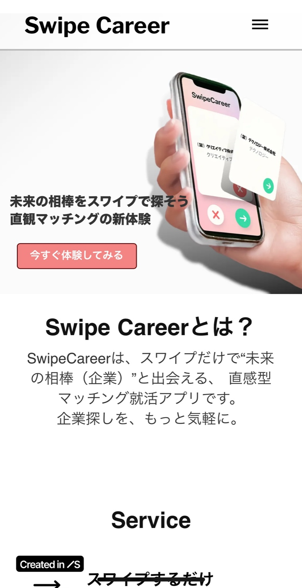
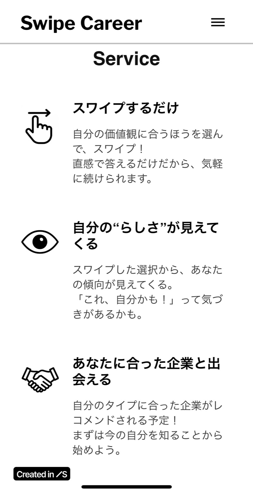
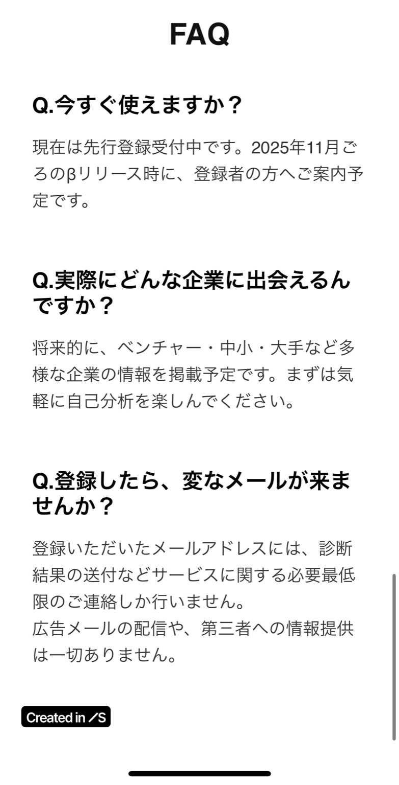

# Takahashi's Product Design Portfolio for SmartHR

## はじめに
本ポートフォリオでは、現在プロトタイプレベルで開発中の就活支援サービス「SwipeCareer」について紹介します。  
就職活動で直感と自己理解がうまく結びつかないという課題感から、「スワイプで直感的に企業を選び、AIが自己分析を補完する」体験を設計しています。  
本サービスは、UI/UX設計・LP制作・ユーザーログ設計などを通じ、実装検証とビジネス検討を並行して進めています。  
**このプロジェクトを通じて、プロダクト開発における仮説設計と体験設計の思考プロセスを提示します。**

---

## プロジェクト：SwipeCareer

###  コンセプト
「直感 × 自己分析」で、就活初期の行動を後押しするマッチングサービス。  
就活における最大の障壁は“最初の一歩”だと考え、情報収集よりも「とりあえずスワイプしてみる」という動機設計からアプローチしました。  
企業をTinderのようにスワイプして選ぶことで、感覚的な好みを可視化。  
その結果をもとに、自己分析風のフィードバックを送付し、直感と納得をつなぐ選択体験をつくります。

従来の就活アプリは「ある程度考えが進んだ学生」向けの設計が多く、初期段階の“迷い”や“とりあえず触ってみたい”というニーズには応えていません。  
SwipeCareerでは、就活初期のハードルを限りなく下げ、「選ぶ」からではなく「感じる」ことから始まる体験設計を試みています。

### 解決しようとした課題

- 「どんな企業が合っているか分からない」という就活生の迷い  
　→ 自己理解が浅い段階では、“合う／合わない”の判断基準すら持てないため、意思決定が止まってしまう

- スカウト・求人アプリの情報過多により行動が止まる構造  
　→ 情報はあるのに“動けない”という矛盾が、就活の初期に特に起きやすい

- 自己分析だけでは生まれにくい“感覚的な相性”  
　→ 数値や言語で測れない“なんとなくの好み”も就職には不可欠だが、既存の自己分析ツールではそれが反映されづらい

### 担当領域

- アイデア設計／UX設計／ユーザーシナリオ構築  
　→ ユーザーの就活初期の心理状態を起点に、行動誘導の導線や情報設計を検討

- ランディングページ構成・コピー・簡易デザイン  
　→ LPはユーザーの第一接点と定義し、広告からの導線と読みやすさ・納得感を重視した構成

- 仮説に基づいた診断ロジック設計  
　→ 回答パターンごとの分類ロジックを設計し、“AIが診断する風”の体験演出を設計

- 初期検証用の簡易LPと広告出稿  
　→ GoogleフォームやMeta広告を用い、初期ユーザーの行動ログ取得と仮説検証を人力で実施

### 資料・デモ
- LPスクリーンショット(モバイルUI)：

  

  
  
  

- Figmaプロトタイプ（準備中）

---

## 今後の展開

現在、広告出稿を前提としたLP制作とCTA設計を進めています。  
初期検証の評価指標としては、クリック率（CTR）1〜2%、登録完了率（CVR）10〜15%を仮設定し、実数値との乖離から体験改善の余地を探る計画です。

ユーザーの反応によっては、当初の「自己分析型UX」に加え、企業の“雰囲気”や“人柄”を起点とする「ショート動画型UX」への重心移動も視野に入れています。  
これは「就活初期ユーザーは情報より感覚を優先する」という仮説に基づくもので、構想の深化と位置付けています。

さらに、プロダクトの継続的な改善と拡張に向け、ユニットコスト（LP誘導単価や登録あたりのCPA）も同時に試算中です。  
これらの数値は単なる獲得効率ではなく、**継続利用につながる体験の選定に用いる指標**として位置づけています。  
**初回接触から中長期の価値提供までを見据えたUX設計**に向け、今後も仮説検証を重ねていく方針です。

---

## 📮 Contact
- 氏名：高橋
- メール：yourmail@example.com
- GitHub：[@yourgithub](https://github.com/yourgithub)
